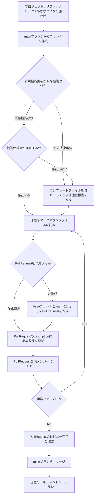

# プロダクト機能仕様書 / Product Feature Specification

あなたのプロダクトの機能仕様書を管理・公開するためのリポジトリです。

This repository is for managing and publishing the feature specifications of your product.

---

## このリポジトリで管理するもの / Items Managed in This Repository
- [/docs](./docs): プロダクトの機能仕様書を管理するディレクトリ  
Directory for managing product feature specifications

## セットアップ / Setup
### テンプレートリポジトリからリポジトリを作成 / Create a repository from the template repository
[テンプレートリポジトリ](https://github.com/Dai1678/product_specification_template)からリポジトリを作成してください。

Please create a repository from the [template repository](https://github.com/Dai1678/product_specification_template).

### 翻訳機能を使うためにOpenAIのAPIキーを取得 / Get an OpenAI API key to use the translation feature
翻訳機能を使うためには、OpenAIのAPIキーが必要です。  
[OpenAIのサイト](https://platform.openai.com/api-keys)からAPIキーを取得してください。

To use the translation feature, you need an OpenAI API key.  
Please obtain an API key from the [OpenAI website](https://platform.openai.com/api-keys).

## 機能仕様書の書き方 / How to Write a Feature Specification
### 全体の流れ / Overall Flow



### 機能ごとにディレクトリを作成する / Create a directory for each feature
画面ごとに仕様書を作成するのではなく、機能ごとにディレクトリを作成し、その中に仕様書を作成してください。

プロダクトの機能を確認し、ディレクトリの分け方を決めておくと良いでしょう。

Create a directory for each feature instead of creating a specification file for each screen.  
Review the product features and decide how to divide the directories.

### 機能仕様書のテンプレートから作成する
main branchからブランチを作成し、機能仕様書のテンプレートをコピーして作成してください。

Create a branch from the main branch and copy the feature specification template to create a feature specification.

[./docs/template/template.md](./docs/template/template.md)

```zsh
$ cd product_specification_template
$ git switch -c {branch_name}
```

## 翻訳が必要な場合 / If translation is required
翻訳元のファイルを `product_specification/ja/` に追加し、GitHub Actionsで`ai_translate.yml`を実行してください。

Add the original file to `product_specification/en/` and run `ai_translate.yml` with GitHub Actions.

## ドキュメントの公開 / Publishing Documents
このテンプレートリポジトリではドキュメントの公開機能は提供していません。  
必要に応じて、GitHub PagesやBackstageなどを利用してドキュメントを公開してください。
