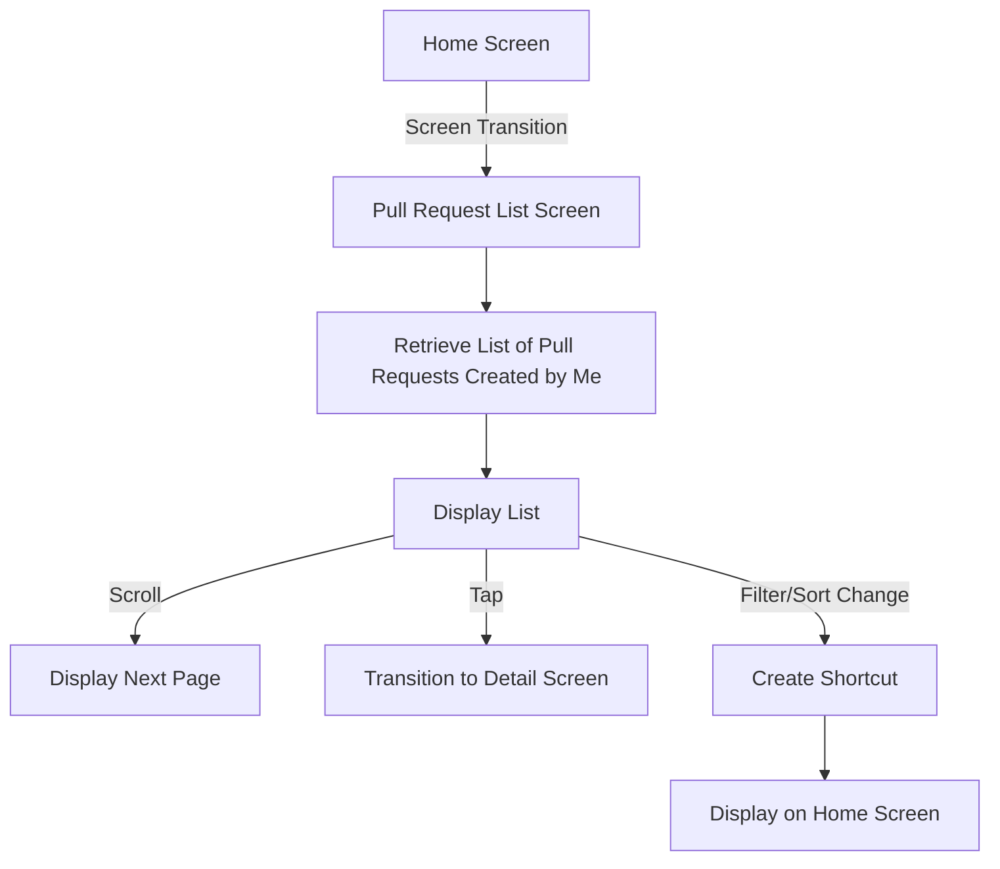
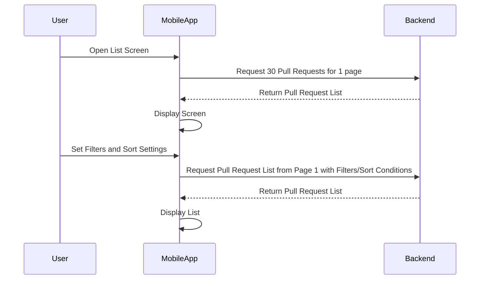

# Pull Requests Feature Specification

## List of Screens Related to This Functionality

| Screen Name | Functional Requirements | Figma Link |
|---|---|---|
| My Tasks Pull Request List Screen | ・Display a list of Pull Requests related to the user | [iOS]() [Android]() |
| Repository Pull Request List Screen | ・Display a list of Pull Requests related to the repository | [iOS]() [Android]() |
| Pull Request Detail Screen | ・Display and edit detailed information ・Code change preview ・Pull Request review ・Show commit history ・Display and post comments | [iOS]() [Android]() |

---
# Display List of Pull Requests Related to the User
## Screen Display Information

### Input Information

| Item Name | Description | Data Format | Initial Value | Input Range/Constraints | Required/Optional |
|-----|----|-------|-----|---------|-------|
| Pull Request Status | Can filter by Pull Request status | ・Open ・Merged ・Closed ・Pending ・All | Open | Select one from dropdown | Optional |
| Relationship with User | Can filter by user's relationship to the Pull Request | ・Created by Me ・Assigned to Me Mentioned Me ・Review Requested Related | Created by Me | Select one from dropdown | Optional |
| Visibility | Can filter by repository visibility | ・Show All ・Private Repositories Only ・Public Repositories Only | Show All | Select one from dropdown | Optional |
| Organization | Can filter by Pull Requests in specific organizations | List of organizations the user belongs to | Pull Requests from all organizations including those not belonging to any organization | Multiple selections allowed | Optional |
| Repository | Can filter by user's specific repository Pull Requests | List of the user's repositories | All repositories | Multiple selections allowed Filtered by OR condition with organization filter | Optional |
| Sort Order | Settings for order of Pull Request list | ・Newest or Oldest ・Most or Least Comments ・Recently Updated or Oldest Updated ・Most Reactions | Newest | Select one condition only | Optional |

### Domain Knowledge

<!--
If there are any definitions of terms necessary to understand the functional specifications, please list them as bullet points.
Consider creating a new page with links if these terms frequently appear in other functional specifications.
-->

None

### Sequence Diagram

### REST API Endpoint Used

<!--
List the names of REST API endpoints used by each system for this functionality as bullet points.
-->

**iOS・Android**

- 

**{microservice}**

-

### GraphQL Query/Mutation Used

<!--
List the GitHub links to GraphQL Query/Mutation files defined by the frontend for this functionality as bullet points.
-->

**iOS**

- 

**Android**

- 

---

# Related Information

## Related Requirements/Specification Documents

<!--
List the URLs of requirement/specification documents for projects that added or modified functionality for this feature as bullet points.
-->

- 

## Related Product Backlog Items/Issues

List the URLs of Product Backlog Items or Issues for adding or modifying this feature as bullet points.

- 

## Other Functional Specifications Related to Screens

<!--
There may be screens included in this functionality that have other functionalities.
Please list the links to their functional specification documents as bullet points.
-->

- XX Screen
    - 

## References

<!--
Please list URLs for any other information related to this functionality as bullet points.
-->

- 