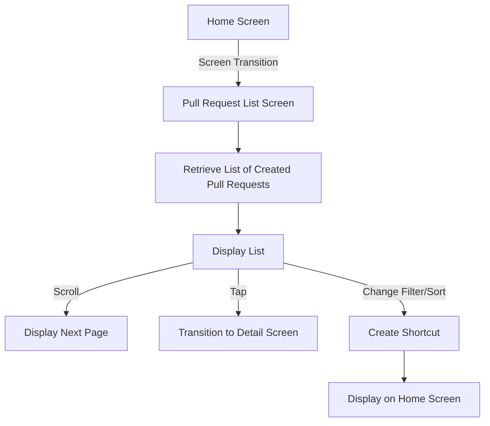
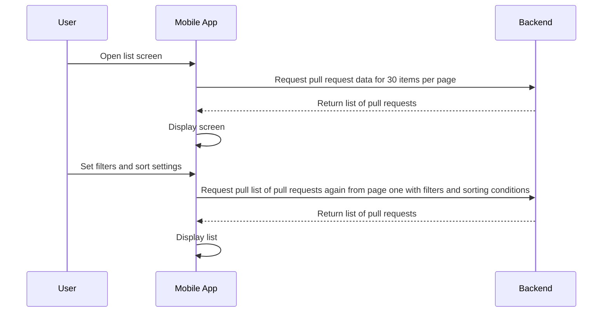

# Pull Requests Feature Specification

## List of Screens Related to This Feature

| Screen Name | Functional Requirements | Figma Link |
|---|---|---|
| My Pull Request List Screen | ・Display a list of pull requests related to the user himself | [iOS]() [Android]() |
| Repository Pull Request List Screen | ・Display a list of pull requests related to the repository | [iOS]() [Android]() |
| Pull Request Detail Screen | ・Display and edit detailed information ・Preview code changes ・Pull request review ・Display commit history ・Display and post comments | [iOS]() [Android]() |

---

# Display a list of pull requests related to the user himself
## Screen Display Information

### Input Information

| Item Name | Description | Data Format | Initial Value | Input Range/Constraints | Required/Optional |
|-----|----|-------|-----|---------|-------|
| Pull Request Status | Can filter by pull request status | ・Open ・Merged ・Closed Pending ・All | Open | Select one from dropdown | Optional |
| Relationship with Pull Request | Can filter by the user's relationship to the pull request | ・Created by me ・Assigned to me Mentioned me Review request Related | Created by me | Select one from dropdown | Optional |
| Visibility | Can filter by repository visibility | ・Show all ・Private repositories only ・Public repositories only | Show all | Select one from dropdown | Optional |
| Organization | Can filter by pull requests of specific organizations | List of organizations the user belongs to | Pull requests from all organizations and repositories not belonging to any organization | Multiple selections possible | Optional |
| Repository | Can filter by pull requests of the user's specific repositories | List of user's repositories | All repositories | Multiple selections possible Filtered with OR condition with organization filter | Optional |
| Sorting Order | Set the sorting order of the pull request list | ・Newest or Oldest ・Most or Fewest comments ・Recently updated or Oldest updates ・Most reactions | Newest | Select only one condition | Optional |

### Domain Knowledge

<!--
If there are any term definitions necessary to understand the functional specifications, list them here in bullet points.
Consider creating a new page and linking them if they frequently appear in other functional specifications.
-->

None

### Sequence Diagram

### REST API Endpoints Used

<!--
List the REST API endpoints used by each system for this feature in bullet points.
-->

**iOS・Android**

- 

**{microservice}**

-

### GraphQL Queries and Mutations Used

<!--
List links to Github files of the GraphQL Queries and Mutations defined by the front end for this feature in bullet points.
-->

**iOS**

- 

**Android**

- 

---

# Related Information

## Related Requirement Documents

<!--
List URLs of requirement documents of projects that added or modified features for this functionality in bullet points.
-->

- 

## Related Product Backlog Item・Issue

List URLs of Product Backlog Items and Issues that added or modified features for this functionality in bullet points.

- 

## Other Functional Specifications Related to Screens in This Feature

<!--
Screens included in this feature may have other functionalities.
List links to the functional specifications of those functionalities in bullet points.
-->

- XX Screen
    - 

## References

<!--
List URLs of other information related to this feature in bullet points.
-->

- 