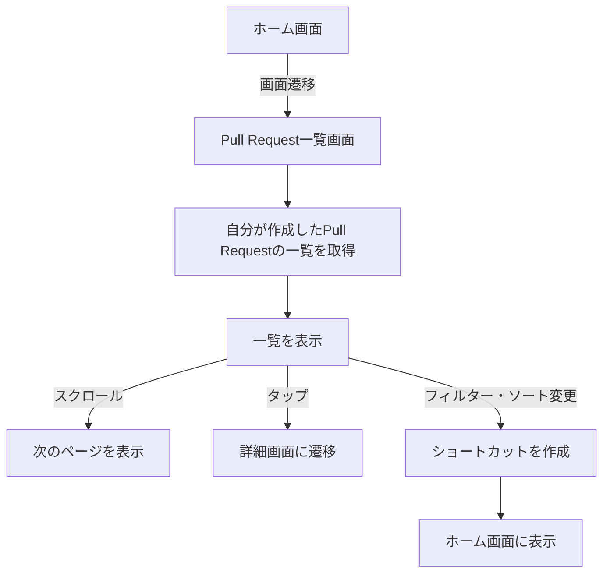
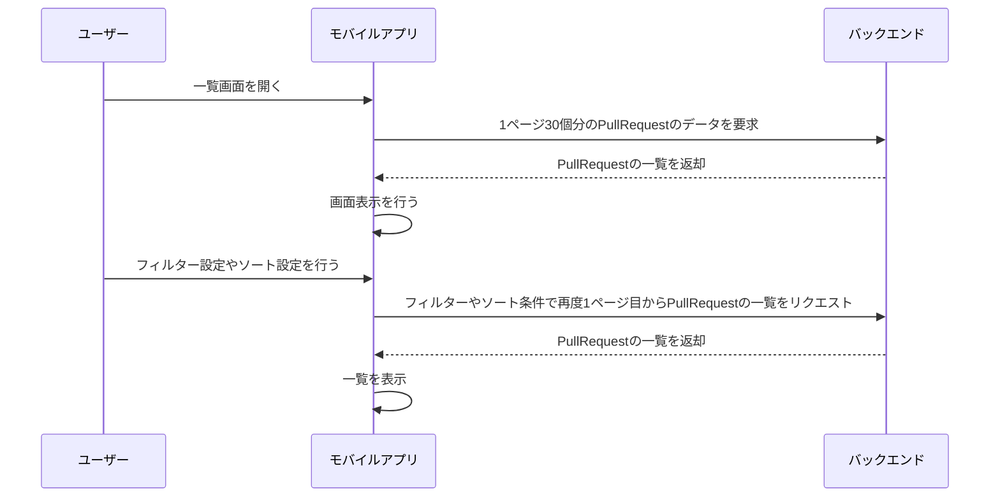

# Pull Requests機能仕様書

## この機能に関連する画面の一覧

| 画面名 / Screen Name | 機能要件 / Functional Requirements | Figma Link |
|---|---|---|
| 自分の作業 Pull Request一覧画面 | ・ユーザー自身に関連するPull Requestの一覧の表示 | [iOS]() [Android]() |
| リポジトリのPull Request一覧画面 | ・リポジトリに関連するPull Requestの一覧の表示 | [iOS]() [Android]() |
| Pull Request詳細画面 | ・詳細情報の表示、編集 ・コード変更のプレビュー ・Pull Requestレビュー ・コミット履歴の表示 ・コメント表示・投稿 | [iOS]() [Android]() |

---
# ユーザー自身に関連するPull Requestの一覧の表示
## 画面表示情報

### 入力情報

| 項目名 | 説明 | データ形式 | 初期値 | 入力範囲・制約 | 必須/任意 |
|-----|----|-------|-----|---------|-------|
| Pull Requestの状態 | Pull Requestの状態でフィルターできる | ・オープン ・マージ ・クローズ 処理待ち ・すべて | オープン | プルダウンで一つ選択 | 任意 |
| Pull Requestとユーザーの関係 | PullRequestに対するユーザーの関係でフィルターできる | ・自分が作成 ・自分に割り当て済み 自分にメンション ・レビューのリクエスト 関係あり | 自分が作成 | プルダウンで一つ選択 | 任意 |
| 可視性 | リポジトリの可視性でフィルターできる | ・すべてを表示 ・プライベートリポジトリのみ ・パブリックリポジトリのみ | すべてを表示 | プルダウンで一つ選択 | 任意 |
| 組織 | 特定の組織のPull Requestのみでフィルターできる | ユーザーが所属している組織の一覧 | すべての組織および組織に属さないリポジトリのPull Request | 複数選択可 | 任意 |
| リポジトリ | ユーザーの特定のリポジトリのPull Requestでフィルターできる | ユーザー自身のリポジトリ一覧 | すべてのリポジトリ | 複数選択可 組織フィルターとOR条件でフィルターされる | 任意 |
| 並び替え順 | Pull Request一覧の並び順の設定 | ・最新or最古 ・コメントが多い順or少ない順 ・最近の更新or更新が古い順 ・リアクションが多い順 | 最新 | いずれかの条件から一つのみ | 任意 |

### ドメイン知識

<!--
機能仕様を理解するために必要な用語の定義があれば箇条書きで記載してください。
他の機能仕様書でも頻出されるものについては、別途新しくページを作成して相互にリンクを記載することを検討してください。
-->

なし

### シーケンス図

### 使用しているREST API endpoint

<!--
この機能について各システムで使用しているREST APIのエンドポイント名を箇条書きで記載してください。
-->

**iOS・Android**

- 

**{microservice}**

-

### 使用しているGraphQL Query・Mutation

<!--
この機能についてフロントエンドが定義しているGraphQL Query・MutationファイルのGithubリンクを箇条書きで記載してください。
-->

**iOS**

- 

**Android**

- 

---

# 関連情報

## 関連する要求・要件定義書

<!--
この機能に対して機能追加や改修を行ったプロジェクトの要求・要件定義書のURLを箇条書きで記載してください。
-->

- 

## 関連するProduct Backlog Item・Issue

この機能に対して機能追加や改修を行ったProduct Backlog ItemやIssueのURLを箇条書きで記載してください。

- 

## この機能に関連する画面が持つ他の機能仕様書

<!--
この機能に含まれる画面が他にも別の機能を持っている場合があります。
それらの機能仕様書のリンクを箇条書きで記載してください。
-->

- XX画面
    - 

## 参考資料 / **References**

<!--
その他、この機能に関連する情報のURLを箇条書きで記載してください。
-->

- 
